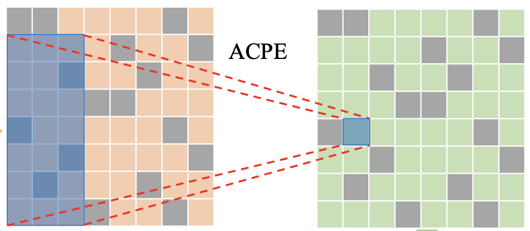
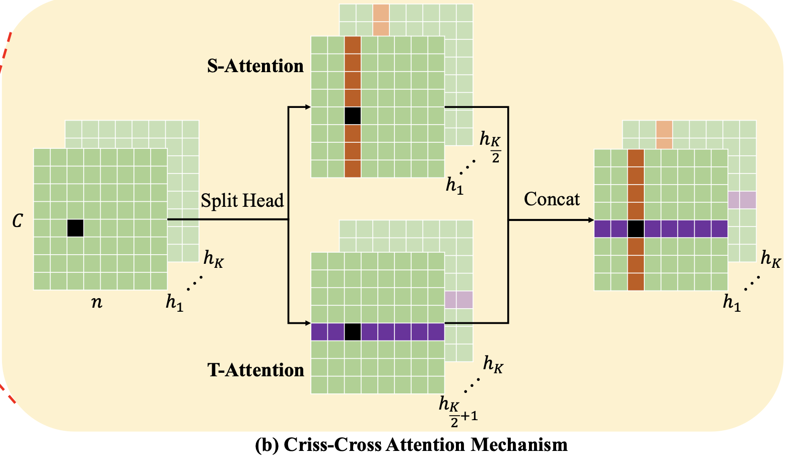
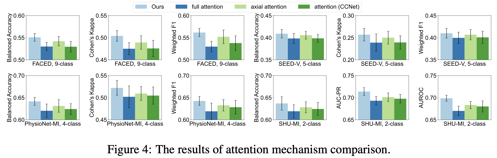
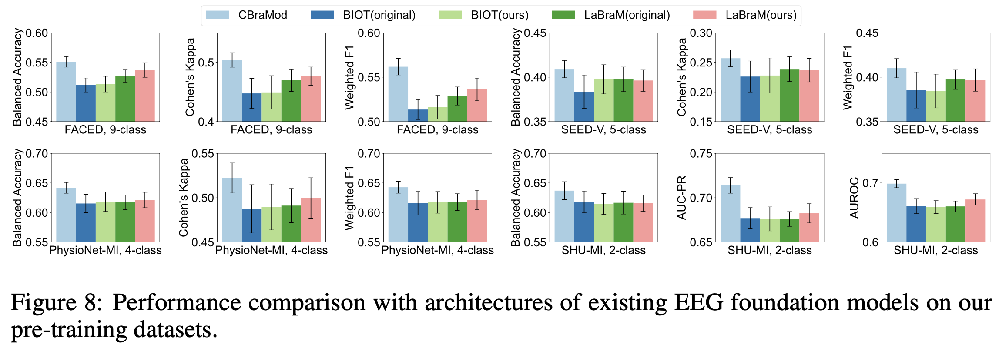
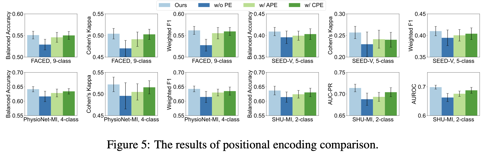

# CBraMod — Paper Investigation

This repository investigates **CBraMod**, a foundation model for EEG signals based 
on a criss-cross transformer architecture. It provides a short summary of the paper, 
reproduces its experiments, and explores potential improvements.

- **Notebook 1** — Reproduces the fine-tuning experiments from the paper on the SHU-MI 
motor imagery dataset. (Part II)
- **Notebook 2** — Investigates strategies to enhance performance. (Part III)

---

## What problem does it address?

EEG signals present two core challenges :

1. **Spatio-temporal dependencies.** EEG carries both spatial information and temporal dynamics. 
Standard transformers, treat all sequences equally, but in EEG, dependencies between patches cross-channel are essential. For example, when you imagine moving your left hand, different brain regions must coordinate simultaneously across both space and time. 

2. **Variability across datasets.** EEG recordings vary in the number of electrodes and signal duration depending on the acquisition setup and clinical context. A generalizable model must handle this heterogeneity.

---

## What they propose

### 1. Asymmetric Conditional Positional Encoding (ACPE)

Depthwise convolution layer that learns positional information dynamically from the input, rather than relying on fixed sinusoidal encodings as in the language models or learned parameter per channels as in LaBraM. The asymmetric design uses a large kernel to capture long-range spatial dependencies across EEG channels, and a smaller kernel for short-range temporal relationships across patches.

### 2. Criss-Cross Transformer Layers

A custom attention mechanism that splits the attention heads into two groups: one attending along the **spatial axis** and one along the **temporal axis**.

---

## Experiments

A strong point of the paper is the number of experiments: the model is benchmarked across many datasets with varying numbers of channels and signal lengths, covering tasks from motor imagery to pathology detection. In my opinion, these are the most significant ones :

---

# PART III

## Limitations

**Signal lengths** Despite being presented as a generalizable foundation model, CBraMod handles dataset heterogeneity by fixing the input format: all signals are segmented into 1-second windows and resampled at 200Hz. Different tasks operate at different timescales. Motor imagery is usually shorter than an emotional response. Forcing everything into 1-second windows may simply cut the signal on a relevant brain dynamics.

**Positional encoding design** The positional encoding is tied to a fixed grid of electrodes since the kernel size for the number of channels is kept constant across datasets, while some montage have up to 62 channels. This means the positional encoding, which encodes a fixed `(n_channels, n_patches)` grid, is never truly transferable across datasets with different topologies. The paper does show that the ACPE helps during pretraining (see figure below), which makes sense: it provides a useful inductive bias. But it does not constitute genuine cross-dataset spatial generalization.

So when fine-tuning on a new dataset with a different electrode setup, the model has to re-learn spatial relationships from scratch. The benefit of pretraining on this component is almost completely lost.

This is a problem for a foundation model. We demonstrate this in **Notebook 1**, where we fine-tune CBraMod on SHU-MI, a binary motor imagery task. SHU-MI uses 32 channels and only 4 temporal patches per trial, compared to 19 channels and 30 patches seen during pretraining. The model overfits quickly and reaches sub-optimal performance, not because the architecture is too large, but because the positional encoding provides almost no useful signal in this new configuration, forcing the model to learn the task with very little spatial context. We try to solve this task-agnostic fine-tuning in **Notebook 2**.

---

## Possible architecture ameliorations 

**Signal lengths.** Cutting patches to fixed 1-second windows can be too aggressive, particularly when an event spans a boundary. Allowing patches to overlap would soften this constraint, and reconstruction could then rely on a simple weighted averaging scheme to recombine overlapping segments.

**Flexible positional encodings.** Using the 3D coordinates of electrode positions as input to a small MLP produces a spatial encoding that is dataset-agnostic by construction, the same encoding applies regardless of the number of channels or the headset used. This encoding would simply be added to a temporal position embedding, and the goal would be to learn a mapping from 3D coordinates to a representation that captures spatial relationships across the scalp. An implementation is available in **Notebook 2**.

However, raw 3D coordinates carry no functional prior. For motor imagery for instance, C3 and C4 are functionally coupled despite being spatially symmetric, which geometry alone cannot capture. BrainJEPA addresses a similar issue in fMRI by learning a functional connectivity matrix that encodes inter-region relationships. A comparable approach for EEG could augment the geometric encoding with a learned or data-driven connectivity term, providing both anatomical and functional context to the spatial representation.

**Pre-training objective.** While I think that the criss-cross attention module is a smart idea to incorporate spatial information in the attention mechanism, the current masked patch reconstruction task operates within each channel independently. The model learns to reconstruct a missing patch from its temporal context within the same channel, but never has to integrate information across channels to do so. This is a significant limitation: it means the pre-training task does not explicitly reward the model for learning cross-channel dependencies, which are arguably the most important ones for EEG understanding. BrainJEPA, which is a foundation model first designed for fMRI, use of I-JEPA where context and target blocks are sampled randomly across the full spatio-temporal volume is a much more demanding and informative objective. I think that applying a similar multi-block, cross-channel prediction task to EEG pre-training could improve the quality of learned representations.

**Local attention mechanism.** Although temporal embeddings inform the model about patch proximity, the attention mechanism itself remains position-agnostic, every patch attends to every other equally. Restricting attention to local windows, as in the Swin Transformer, would encourage the model to first build local representations before aggregating globally. This locality bias could be applied along both the temporal and channel dimensions, allowing the model to capture short-range temporal dynamics and spatially neighboring electrodes jointly.

